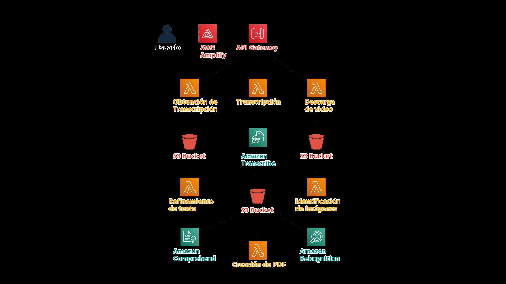

**Equipo 37 - BusinessSoft**

Integrantes:

- Gamiño Gónzalez José Luis
- Guerra Silva Erick Iván
- Lázaro Martínez Abraham Josué
- López López Rodrigo
- Martínez Gutiérrez Carlos Giovanni
- Oropeza Castañeda Ángel Eduardo

**Nombre del proyecto: LightClass**

**Problemática:** Educación

**Introducción:**

La pandemia por la que estamos pasando ha traído una serie de cambios que han generado un impacto muy fuerte en la manera que hacemos todas nuestras actividades,

la manera en la que socializamos, comunicamos, trabajamos, aprendemos, etc. Consecuentemente han surgido nuevos retos para todas las disciplinas que se han visto afectadas y aunque los recursos digitales nos han permitido desarrollar muchas de nuestras actividades, es el momento para solucionar y complementar los recursos para obtener un resultado más fiel al que estábamos acostumbrados previo a la pandemia.

**Problema a resolver:**

Uno de los problemas más notables que pudimos identificar debido a la pandemia de COVID-19 referente a la educación fue el problema de la conexión a internet. Muchos estudiantes no cuentan con una conexión a internet lo suficientemente estable como para tomar las clases de vía streaming, o incluso por recursos audiovisuales.

Como consecuencia, se ha visto afectado el desempeño de los alumnos al igual que la comprensión de los temas, aspectos que resultan importantes para la formación de los estudiantes.

Otra de las problemáticas que percibimos es la falta de material didáctico de los profesores, ya que al igual que los alumnos, ellos también tuvieron que enfrentarse a un ambiente meramente digital, lo que para algunos de ellos es un escenario completamente desconocido, provocando que las clases fuesen pobres y los profesores no pudieran compartir sus conocimientos de la manera que lo desean.

**Objetivo:**

Generar recursos educativos en un formato más accesible y amigable a los alumnos con problemas de conexión a través de los recursos audiovisuales que los profesores comparten así como los elementos que encuentren y resultan un buen complemento para sus clases, todo mediante una aplicación web.

**Solución:**

Con el uso de servicios de Amazon Web Services (AWS) se busca combatir y mitigar los problemas mencionados anteriormente, ofreciendo una herramienta encargada de realizar resúmenes de las clases y material didáctico adicional. Este material tiene como objetivo ayudar a los profesores a tener recursos que faciliten y complementen la enseñanza de los temas y por otra parte, apoyaría a los alumnos al aprendizaje en caso de no contar con una internet estable, teniendo la posibilidad de revisar lo visto en clase.

Para el desarrollo de la solución se plantea el uso de los servicios de Inteligencia Artificial de AWS como es el caso de Transcribe, Comprehend y Rekognition como núcleo. Empleamos Amplify para crear una página estática y la funcionalidad estará de la mano de funciones lambda y API GATEWAY.

**¿Cómo funciona?**

Usuario:

El usuario entrará a la aplicación, ingresará el URL de YouTube del material que desea generar el material y dará clic en convertir, únicamente será cuestión de esperar el material en formato PDF.

Funcionamiento interno:

A través de Amplify se recibirá un URL de YouTube, mismo que será mandado a una función Lambda para ser descargado y almacenado en un Bucket de S3, una vez en el bucket, otra función Lambda la toma y realiza la transcripción utilizando Amazon Transcribe y almacena la transcripción en el Bucket, misma que será tomada por otra función lambda que haga uso de Amazon Comprehend para refinar el texto; por otro lado, una función lambda buscará dentro del video las imágenes en las que se encuentre la información relevante y poder anexarlas al pdf final, mismo que será retornado al usuario para su descarga.

Arquitectura propuesta:

Se utilizaron diversos servicios de Amazon Web Services como se muestra a continuación.

# HackatonAWS

Archivos:

* conect.py:
Archivo con las funciones necesarias para generar las llaves para poder generar los objetos tipo cliente 

* transcribe.py:
Genera un cliente de tipo transcribe
También contiene una función que inicia la transcripción de un texto

* obtenerTexto.py:
Ayuda al archivo transcribe.py para determinar el momento en que la trascripción termina y regresa el texto y los items para poder ocupar el texto en otra función o para poder determinar la confianza de cada palabra

* comprehend.py:
Genera un cliente de tipo comprehend 
También contiene una función que inicia la comprensión de un texto 

* s3.py
Genera un cliente de tipo S3
También contiene una función para borrar un archivo de determinado bucket
